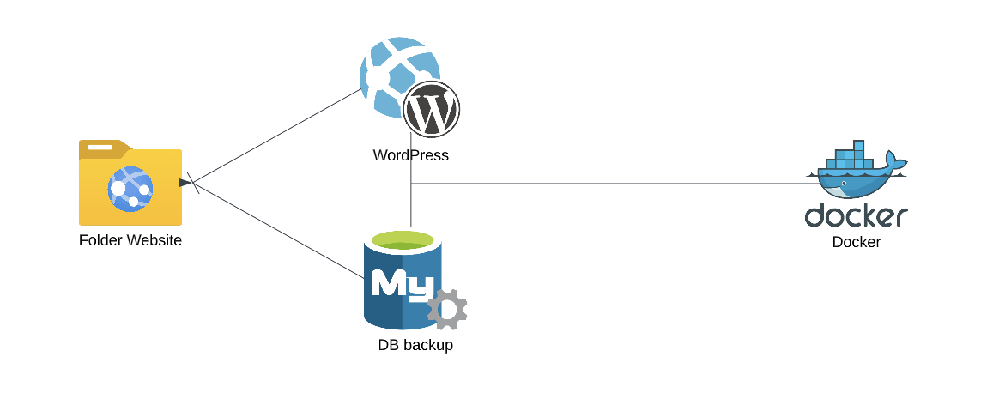
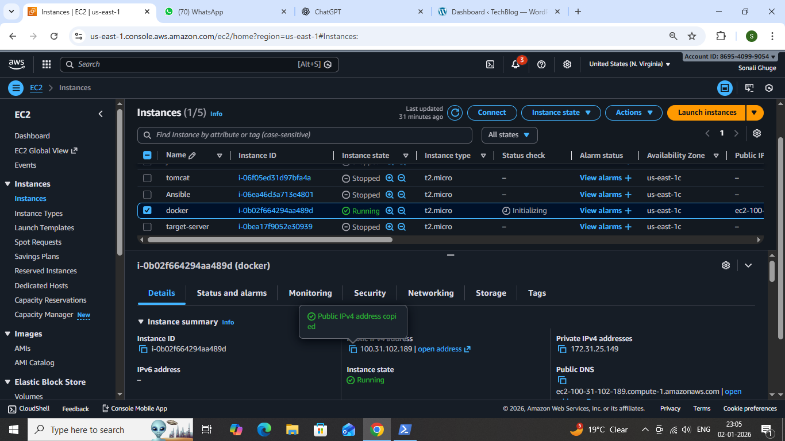
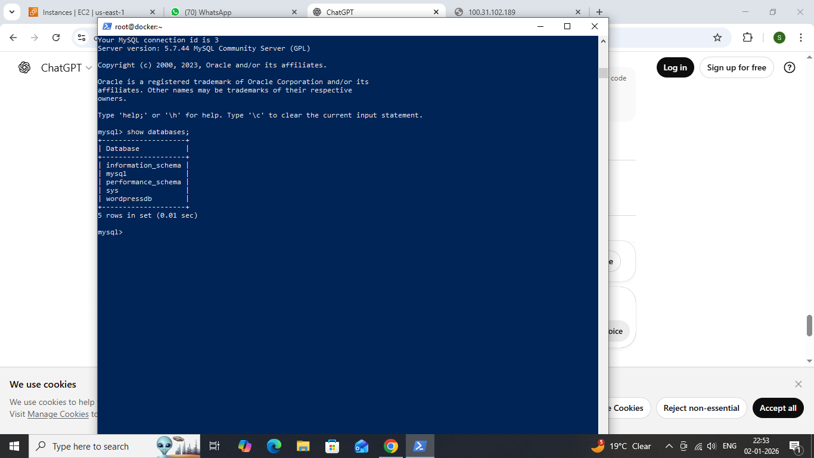

# 2tier-aritecture-deployment-on-wordpress-using-docker

### Project Description

This project demonstrates how to deploy a WordPress website using Docker containers with a MySQL database backend. The application follows a 2-Tier Architecture, where WordPress (Application Layer) and MySQL (Database Layer) run in separate containers and communicate using Docker networking.

Docker helps in making the deployment portable, scalable, and easy to manage.

### Technologies Used

- Docker

- Docker Hub Official Images

- Linux (Ubuntu)

- AWS EC2

- WordPress

- MySQL

### Architecture
       +----------------------+
       |   User / Browser     |
       +----------+-----------+
                  |
                  v
       +----------------------+
       | WordPress Container  |
       | (App Tier )          |
       +----------+-----------+
                  |
                  v
       +----------------------+
       |  MySQL Container     |
       | (DB Tier)            |
       | Wordpress            | 
       +----------------------+

### Architecture Type

### 2-Tier Architecture

- Tier 1 – Application Tier: WordPress

- Tier 2 – Database Tier: MySQL

### Prerequisites

- AWS EC2 instance (Ubuntu)

- Docker installed and running

- Basic knowledge of Docker & WordPress

### Steps to Deploy WordPress Using Docker

### 1. Launch A EC2 Instance

### Step 2: Install Docker

     sudo apt update
     sudo apt install docker -y
     sudo systemctl start docker
     sudo systemctl enable docker

 ### Verify Docker installation:

     docker --version

### Step 3: Pull Docker Images
     docker pull mysql:5.7
     docker pull wordpress
### Step 4: Create MySQL Container
    docker run -d \
    --name mydb \
    -e MYSQL_ROOT_PASSWORD=root \
    -e MYSQL_DATABASE=wordpressdb \
    mysql:5.7

### Step 5: Create WordPress Container
    docker run -d -p 80:80 \
    --name wordpressapp \
    -e WORDPRESS_DB_HOST=mydb \
    -e WORDPRESS_DB_USER=root \
    -e WORDPRESS_DB_PASSWORD=root \
    -e WORDPRESS_DB_NAME=wordpressdb \
    --link mydb:mysql \
    wordpress

### Explanation

- -p 80:80 → Exposes WordPress on browser

- WORDPRESS_DB_HOST → MySQL container name

- --link → Connects WordPress container to MySQL container 

### Step 6: Access WordPress

Open browser and visit:

      http://<SERVER-IP>:80
### Wordpress login page      

      

### Wordpress Dashboard

### Step 7: Verify Running Containers
     docker ps

### Step 8: Access Container Shell
    docker exec -it <container_id> /bin/bash

### Step 9: Access MySQL Database
     docker exec -it mydb /bin/bash
     mysql -u root -p

     

### Environment Variables Used
    Variable Name	         Description
    WORDPRESS_DB_HOST	     MySQL container name
    WORDPRESS_DB_USER	     Database username
    WORDPRESS_DB_PASSWORD    Database password
    WORDPRESS_DB_NAME	     Database name

### Advantages of Using Docker for wordpress

- Easy & fast deployment

- Platform independent

- Isolated environment

- Scalable architecture

- Beginner-friendly DevOps setup

### Conclusion

This project successfully demonstrates how Docker simplifies WordPress deployment using a 2-Tier Architecture. It is ideal for DevOps beginners and cloud learners to understand containerized application deployment.

### Author

Sonali Ghuge

GitHub: https://github.com/iamSonaliGhuge

